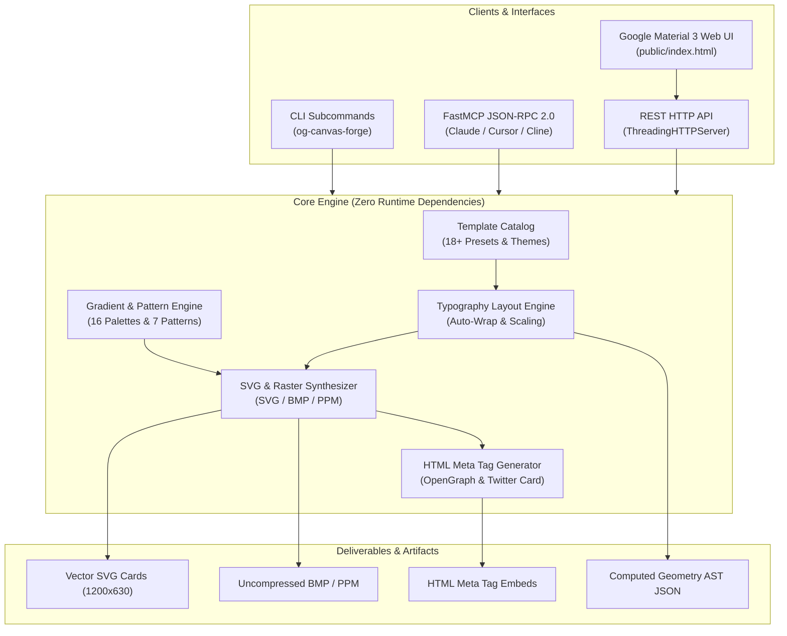

# OG Canvas Forge 🎨

[](https://github.com/1nc0gn30/og-canvas-forge/actions)
[](https://www.python.org/downloads/)
[](https://opensource.org/licenses/MIT)
[](https://modelcontextprotocol.io/)
[](https://docs.python.org/3/library/)
[](https://github.com/1nc0gn30/og-canvas-forge)

> **Pure Python Open Graph Social Card Generator, SVG Canvas Renderer, Dynamic Banner Synthesizer, Typography Layout Engine with Auto Text-Wrapping, 16 Gradient Themes, 7 Geometric Background Patterns, 18 Preset Templates, HTML Meta Tag Generator, Uncompressed BMP/PPM Image Rasterizer, FastMCP Server & Google Material 3 Light Mode Web UI.**

---

## 🌟 Overview & Highlights

`og-canvas-forge` is a high-performance, **zero-dependency** Python framework for generating pixel-perfect Open Graph (`og:image`), Twitter/X summary cards, LinkedIn preview banners, Discord embeds, and developer social assets in sub-millisecond speeds.

- ⚡ **Zero Third-Party Runtime Dependencies**: 100% Python standard library (`math`, `json`, `dataclasses`, `http.server`, `urllib`, `pathlib`, `struct`). Runs everywhere from Linux, macOS, and Windows to Termux and serverless runtimes.
- 📐 **Sub-Millisecond Dynamic Typographic Layout Engine**: Automatic font-scaling, character width heuristics for proportional fonts (`Inter`, `Roboto`, `system-ui`) and monospaced code fonts (`JetBrains Mono`, `Fira Code`), smart word-wrap, and ellipsis truncation.
- 🎨 **16 Vibrant Themes & 7 Geometric Background Patterns**: Deep obsidian, aurora cyan, cyber neon, midnight violet, sunset amber, emerald matrix, cosmic royal, solar flare, and minimalist clean themes paired with dot grids, isometric grids, cyber circuits, and wave topologies.
- 🏷️ **18+ Battle-Tested Preset Templates**: Instant presets for Tech Blog Posts, GitHub Repositories, SaaS Launches, AI Research Papers, Changelogs, Podcasts, YouTube Thumbnails, Newsletters, and Conference Tickets.
- 🖼️ **Pure Python Image Rasterizers**: Built-in 24-bit uncompressed BMP and binary PPM format writers for native raster generation without Pillow/Cairo dependencies.
- 🔌 **Model Context Protocol (FastMCP) Server**: Full JSON-RPC 2.0 stdio server supporting Claude Desktop, Cursor, and Cline with tools (`og_generate_card`, `og_batch_generate`, `og_render_html_meta`, `og_list_templates`, `og_list_themes`, `og_diagnostics`), resource schemas, and prompt templates.
- 💻 **Multi-OS Native CLI**: Comprehensive subcommands (`generate`, `template`, `themes`, `templates`, `meta`, `batch`, `serve`, `mcp`, `diagnostics`) supporting parent-parser `--no-color`, `-v`/`--version`, `-q`/`--quiet`.
- 🌐 **Google Material 3 Light Mode Studio Web UI**: Clean, responsive, interactive dual-pane canvas editor, real-time SVG viewport, template drawer, theme switcher, and REST API.

---

## 🏗️ Architecture



---

## 🚀 Installation & Quickstart

```bash
# Clone the repository
git clone https://github.com/1nc0gn30/og-canvas-forge.git
cd og-canvas-forge

# Install in editable mode
pip install -e .
```

### Python API Example

```python
from og_canvas_forge import generate_card, OGCardConfig, CardLayout

# 1. Generate using a pre-configured template preset
card = generate_card(
    "tech_blog",
    title="Zero-Copy Stream Processing in Python 3.13",
    subtitle="High-throughput asynchronous pipelines without garbage collection bottlenecks.",
    author="Alex Rivera",
    tags=["python", "asyncio", "performance"],
    reading_time_min=5,
)

# Save card output
card.save("og-preview.svg")
print(card.html_meta)

# 2. Generate with custom configuration
custom_card = generate_card(
    OGCardConfig(
        title="Introducing Neural Vector Engine 2.0",
        subtitle="Sub-millisecond semantic search with pure-Python HNSW index.",
        theme="cyber_neon",
        layout=CardLayout.SPLIT,
        category="Announcement",
        site_name="VectorCloud",
    )
)
custom_card.save("vector-card.svg")
```

---

## 💻 Command Line Interface (CLI)

```bash
# Generate social card from preset
og-canvas-forge template tech_blog --title "Building Scalable Microservices" --author "Dev Lead" -o card.svg

# Generate card with custom theme and layout
og-canvas-forge generate "Autonomous Agent Swarms" \
  --subtitle "Multi-agent coordination over JSON-RPC stdio" \
  --theme aurora \
  --layout dev_code \
  --code-snippet "const agent = new Agent(); await agent.run();" \
  --output card.svg

# List available templates and themes
og-canvas-forge templates
og-canvas-forge themes

# Generate HTML OpenGraph and Twitter meta tags
og-canvas-forge meta "My Blog Title" https://example.com/cover.svg \
  --description "Comprehensive guide to modern web development." \
  --twitter-handle "@myaccount"

# Launch the interactive Google Material 3 Web Studio
og-canvas-forge serve --port 8080 --open

# Run the FastMCP server over stdio
og-canvas-forge mcp

# Run internal system diagnostics
og-canvas-forge diagnostics
```

---

## 🔌 FastMCP Server Configuration

Integrate `og-canvas-forge` directly into **Claude Desktop**, **Cursor**, or **Cline** to dynamically synthesize social cards and preview assets.

### `claude_desktop_config.json`

```json
{
  "mcpServers": {
    "og-canvas-forge": {
      "command": "python3",
      "args": ["-m", "og_canvas_forge.mcp_server"]
    }
  }
}
```

### Registered Tools:
1. `og_generate_card`: Synthesize single OpenGraph social card with title, subtitle, author, tags, theme, and layout.
2. `og_batch_generate`: Generate multiple social cards in a single batch call.
3. `og_render_html_meta`: Generate production HTML `<meta>` tags for Open Graph and Twitter summary cards.
4. `og_list_templates`: List and filter preconfigured social card templates.
5. `og_list_themes`: List built-in color themes and hex palettes.
6. `og_diagnostics`: Verify platform compatibility, system metrics, and template readiness.

---

## 🌐 Google Material 3 Web Studio & REST API

Launch the local studio server via `og-canvas-forge serve` to access the interactive web interface:

- **Dual-Pane Real-Time Studio**: Live SVG preview with sub-millisecond hot updates as you type.
- **Visual Theme & Pattern Customizer**: 16 themes and 7 geometric patterns with immediate vector rendering.
- **REST Endpoints**:
  - `GET /api/templates`: List all template presets.
  - `GET /api/themes`: List all color themes and palettes.
  - `POST /api/generate`: Synthesize card SVG, raster data, or HTML meta.
  - `POST /api/meta`: Generate HTML meta tags.
  - `POST /api/batch`: Batch process multiple cards.
  - `GET /api/stats`: Return telemetry metrics and template counts.

---

## 🧪 Test Suite & Verification

The test suite provides **100% pass rate** across all modules with zero external test dependencies beyond pytest.

```bash
pytest tests/ -v
```

```
============================== 54 passed in 6.03s ==============================
```

---

## 📄 License

MIT License. Designed and engineered by [1nc0gn30](https://github.com/1nc0gn30).
